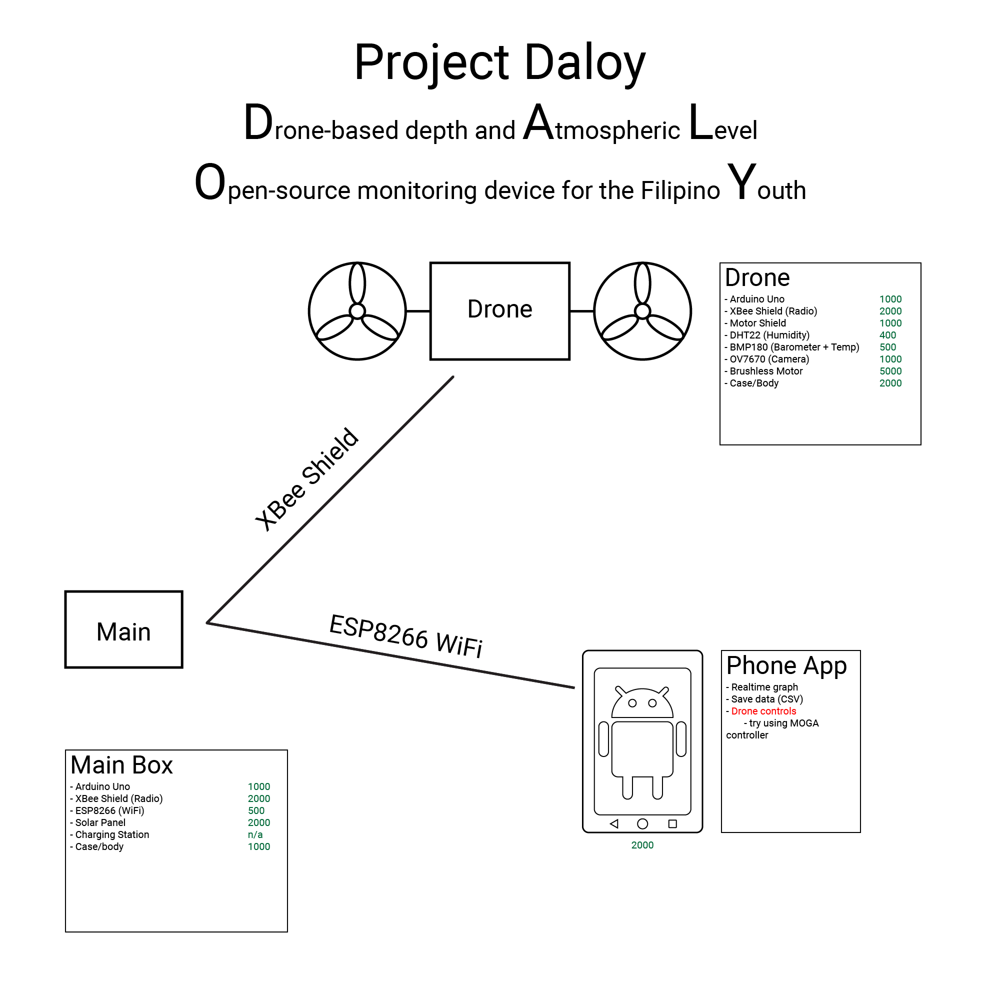

<h1>Project Daloy 
<strong>D</strong>rone-based depth and <strong>A</strong>tmospheric <strong>L</strong>evel <strong>O</strong>pen-source monitoring device for the Filipino <strong>Y</strong>outh</h1>

Git Repository for code and other resources related to the development of <strong>Project Daloy</strong>, the official entry of PSHS-CVisC to <strong>InnoBox: Search for the Most Innovative Teaching and Learning Resources in Science</strong>

<h1>Materials List and Budgetary Requirements</h1>
<table>
	<tr>
		<td colspan="4" style="text-align: center"><strong>Daloy Air (Drone)</strong></td>
	</tr>
	<tr>
		<td><strong>Material</strong></td>
		<td><strong>Unit Cost</strong></td>
		<td><strong>Quantity</strong></td>
		<td><strong>Price</strong></td>
	</tr>
	<tr>
		<td>Arduino Nano</td>
		<td>350</td>
		<td>2</td>
		<td>700</td>
	</tr>
	<tr>
		<td>NRF24L01</td>
		<td>100</td>
		<td>2</td>
		<td>200</td>
	</tr>
	<tr>
		<td>MPU6050 Gyro+Accelerometer</td>
		<td>300</td>
		<td>1</td>
		<td>300</td>
	</tr>
	<tr>
		<td>DHT-11 Humidity</td>
		<td>150</td>
		<td>1</td>
		<td>150</td>
	</tr>
	<tr>
		<td>BMP180 Barometric + Temp</td>
		<td>300</td>
		<td>1</td>
		<td>300</td>
	</tr>
	<tr>
		<td>Camera</td>
		<td>???</td>
		<td>1</td>
		<td>???</td>
	</tr>
	<tr>
		<td>Electronic Brushless Motor Speed Controller ESC</td>
		<td>400</td>
		<td>4</td>
		<td>1600</td>
	</tr>
	<tr>
		<td>Brushless Motors Set x4 </td>
		<td>1500</td>
		<td>1</td>
		<td>1500</td>
	</tr>
	<tr>
		<td>Case / Body</td>
		<td>2000</td>
		<td>1</td>
		<td>2000</td>
	</tr>
	<tr>
		<td>Li-Po Battery 7.4V / 11.1V</td>
		<td>330</td>
		<td>1</td>
		<td>330</td>
	</tr>
	<tr>
		<td>Delivery Charge </td>
		<td>700</td>
		<td>1</td>
		<td>700</td>
	</tr>
	<tr>
		<td colspan="2" style="text-align: center"><strong>Subtotal</strong></td>
		<td colspan="2" style="text-align: right">14680</td>
	</tr>
</table>
<table>
	<tr>
		<td colspan="4" style="text-align: center"><strong>Daloy Ground (Main)</strong></td>
	</tr>
	<tr>
		<td><strong>Material</strong></td>
		<td><strong>Unit Cost</strong></td>
		<td><strong>Quantity</strong></td>
		<td><strong>Price</strong></td>
	</tr>
	<tr>
		<td>Raspberry Pi 3</td>
		<td>2400</td>
		<td>1</td>
		<td>2400</td>
	</tr>
	<tr>
		<td>NRF24L01</td>
		<td>100</td>
		<td>1</td>
		<td>100</td>
	</tr>
	<tr>
		<td>Solar Panel</td>
		<td>2000</td>
		<td>1</td>
		<td>2000</td>
	</tr>
	<tr>
		<td>Charging Station</td>
		<td>???</td>
		<td>1</td>
		<td>???</td>
	</tr>
	<tr>
		<td>Case / Body</td>
		<td>1000</td>
		<td>1</td>
		<td>1000</td>
	</tr>
	<tr>
		<td colspan="2" style="text-align: center"><strong>Subtotal</strong></td>
		<td colspan="2" style="text-align: right">5500</td>
	</tr>
</table>
<table>
	<tr>
		<td colspan="4" style="text-align: center"><strong>Controller and Users</strong></td>
	</tr>
	<tr>
		<td><strong>Material</strong></td>
		<td><strong>Unit Cost</strong></td>
		<td><strong>Quantity</strong></td>
		<td><strong>Price</strong></td>
	</tr>
	<tr>
		<td>Arduino Nano</td>
		<td>350</td>
		<td>1</td>
		<td>350</td>
	</tr>
	<tr>
		<td>NRF24L01</td>
		<td>100</td>
		<td>1</td>
		<td>100</td>
	</tr>
	<tr>
		<td>Li-Po Battery 7.4V / 11.1V</td>
		<td>330</td>
		<td>1</td>
		<td>330</td>
	</tr>
	<tr>
		<td>Android Phone</td>
		<td>2000</td>
		<td>1</td>
		<td>2000</td>
	</tr>
	<tr>
		<td colspan="2" style="text-align: center"><strong>Subtotal</strong></td>
		<td colspan="2" style="text-align: right">2780</td>
	</tr>
</table>

# Total: 14260
<h1>Mass of Drone</h1>
<table>
	<tr>
		<td colspan="4" style="text-align: center"><strong>Daloy Air (Drone)</strong></td>
	</tr>
	<tr>
		<td><strong>Material</strong></td>
		<td><strong>Unit Mass (g)</strong></td>
		<td><strong>Quantity</strong></td>
		<td><strong>Mass (g)</strong></td>
	</tr>
	<tr>
		<td>Arduino Nano</td>
		<td>6</td>
		<td>2</td>
		<td>12</td>
	</tr>
	<tr>
		<td>NRF24L01</td>
		<td>6</td>
		<td>2</td>
		<td>12</td>
	</tr>
	<tr>
		<td>MPU6050 Gyro+Accelerometer</td>
		<td>15</td>
		<td>1</td>
		<td>15</td>
	</tr>
	<tr>
		<td>DHT-22 Humidity</td>
		<td>2.4</td>
		<td>1</td>
		<td>2.4</td>
	</tr>
	<tr>
		<td>BMP180 Barometric + Temp</td>
		<td>4</td>
		<td>1</td>
		<td>4</td>
	</tr>
	<tr>
		<td>Camera</td>
		<td>150</td>
		<td>1</td>
		<td>150</td>
	</tr>
	<tr>
		<td>Electronic Brushless Motor Speed Controller ESC</td>
		<td>22</td>
		<td>4</td>
		<td>88</td>
	</tr>
	<tr>
		<td>Brushless Motors</td>
		<td>50</td>
		<td>4</td>
		<td>200</td>
	</tr>
	<tr>
		<td>Case / Body</td>
		<td>88</td>
		<td>1</td>
		<td>100</td>
	</tr>
	<tr>
		<td>Li-Po Battery 7.4V / 11.1V</td>
		<td>77</td>
		<td>1</td>
		<td>77</td>
	</tr>
	<tr>
		<td colspan="2" style="text-align: center"><strong>Total</strong></td>
		<td colspan="2" style="text-align: right">660.4</td>
	</tr>
</table>
<h1>Proposed Design</h1>
